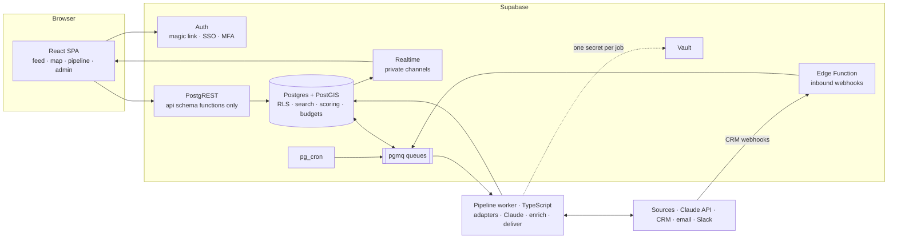

# Design A — Postgres-as-Backend

> **Thesis:** put the rules where the data is. Postgres enforces tenancy, runs search and scoring, meters source budgets and holds the queues. A static React app calls it directly through row-level security, and one small worker does everything that needs the network. There is no application server.

This is one of three [design options](README.md). Decisions shared by all three are documented there and not repeated here: the adapter contract, data-model additions, compliance machinery, geography and the cost model.

## Stack

| Layer | Pick |
|---|---|
| Database | Supabase Postgres with PostGIS, pg_trgm, pgmq (Supabase Queues) and pg_cron (Supabase Cron) |
| Auth | Supabase Auth: magic link, SAML SSO, TOTP MFA. A custom access-token hook adds `tenant_id` and `app_role` to the JWT |
| API | PostgREST, exposing only an `api` schema of functions. Tables live in an `app` schema that PostgREST doesn't expose |
| Frontend | React SPA (Vite, TanStack Router and Query, MapLibre GL, Supercluster) on static hosting |
| Pipeline | One long-running TypeScript worker on Fly.io, consuming pgmq queues |
| Realtime | Supabase Realtime private channels for the new-leads pill and the review-queue badge |
| Secrets | Supabase Vault |
| Inbound HTTP | One Supabase Edge Function for CRM webhooks and privacy requests |
| Email, Slack | Postmark or Resend; Slack incoming webhooks |

## Architecture



## Pipeline

Six pgmq queues carry the work: `discover`, `fetch`, `classify`, `extract`, `enrich` and `deliver`. The worker reads each queue with a visibility timeout. If it crashes partway through a message, the message reappears and is retried.

Edge Functions could run these steps, but their execution-time limits are awkward for rate-limited source runs. A persistent worker keeps the budget and breaker logic simple.

1. **Schedule.** Every 15 minutes, pg_cron runs `enqueue_due_runs()`. For each enabled (tenant, source) pair whose cadence has elapsed (default 6 hours, ING-6), it opens a `source_runs` row and enqueues a `discover` message carrying the stored cursor.
2. **Discover and fetch.** The worker loads the source's adapter, pages through `discover`, and calls `fetch` for each item. Adapters never make HTTP calls directly:
   - **Budget.** The adapter's HTTP client must first get a grant from `take_budget(tenant, source)` (ING-8). That's an atomic `UPDATE … WHERE used + 1 <= limit RETURNING` over per-minute and per-day counters.
   - **Kill switch.** The client checks the source's enabled flag before every request, so disabling a source stops it within one request (SRC-5).
   - **Backoff and breaker.** On a 429 or 403 the client backs off exponentially. A third consecutive failure opens the breaker in `source_health`, ends the run as `halted`, and alerts an admin. It never retries harder or routes around the block (ING-9).
3. **Store raw.** Each item is written with `INSERT … ON CONFLICT (tenant_id, source, external_post_id) DO NOTHING` (ING-7, DB-5). The same step computes the near-duplicate hash (ING-12) and runs the suppression check (PRIV-5). New rows go to `classify`, or straight to `enrich` if they carry a `structured` block from a licensed source.
4. **Interpret.** Posts pass three filters:
   - the regex gate, using patterns from the admin-editable `patterns` table (ING-4)
   - Haiku 4.5, which drops and logs anything below the confidence floor (EXT-4)
   - Sonnet extraction, with evidence-span verification

   Records under the review threshold go to the review queue (EXT-7).
5. **Enrich.** This step resolves each record against reference data:
   - **Location:** the gazetteer centroid, the metro code, and `lead_markets` rows.
   - **Company:** a trigram-similarity match.
   - **Seniority:** a lookup in the title dictionary.
   - **Relocation:** a comparison of the two metros (ENR-5).
   - **Person dedup** (ING-13): match on profile URL first, then on name, company and metro similarity.
6. **Score.** The enrich transaction ends by calling the SQL scorer (below) and inserting the lead with its score.

A message read more than five times moves to `dead_letters` along with its last error. The admin page can re-enqueue it (ING-14). Each run updates its counters in `source_runs` (ING-15). A pg_cron job compares each finished run with the previous three and raises the zero-new-items alert (ING-16).

Re-extraction (EXT-8) is one statement. It enqueues every raw post still inside retention for `extract`, under the new `extractor_version`.

## Scoring in SQL

```sql
-- The scorer's entire view of a lead. Name, photo, school and demographics have no field here.
create type app.scoring_input as (
  is_relocation         app.tristate,
  distance_km           numeric,
  start_date            date,
  seniority_band        app.seniority_band,
  posted_at             timestamptz,
  work_arrangement      app.work_arrangement,
  extraction_confidence numeric
);

create function app.score(i app.scoring_input, w app.scoring_configs, at timestamptz)
returns app.score_result
language sql immutable security definer  -- owned by `scorer`, a role with no table privileges
as $$ … $$;
```

`score()` runs as its owner, `scorer`, a role with no privileges on any table. The function body can't read a table: all it sees is its arguments, and their type has no protected fields. Callers build the input from `app.scoring_inputs_v`, a view that selects only those columns.

Rescoring after a weight change (SCO-3), or nightly for recency decay (SCO-4), is one set-based `UPDATE` per tenant. A CTE in the same statement writes the changed rows to `score_audit` (SCO-7). At 100,000 leads, a rescore takes seconds.

## Tenancy and security

Clients can only call functions in the `api` schema. Those functions run with the caller's rights, so RLS applies to every row they read. The worker sets the job's tenant on its connection, so RLS covers pipeline writes too.

Policies wrap their JWT lookups in a subselect. That's Supabase's documented pattern for evaluating a claim once per query instead of once per row:

```sql
create policy leads_visible on app.leads for select to authenticated using (
  tenant_id = (select app.jwt_tenant_id())
  and exists (
    select 1 from app.lead_markets lm
    where lm.lead_id = leads.id
      and lm.market_id = any ((select app.visible_market_ids()))  -- agent: assigned markets · manager: team · admin: all
  )
);
```

- **A narrow, page-capped API.** The client calls only `lead_page`, `lead_points`, `lead_detail`, `set_status` and `export_view`. These cap page sizes and write the logs the spec requires:
  - `lead_detail` writes the "viewed" audit row (AUD-1).
  - `export_view` checks the caller's role, re-checks suppression, logs the row count and filter (SEC-4, INT-8), and queues the CSV build for the worker.
- **Admin MFA.** Admin functions require the JWT's `aal` claim to be `aal2`. A session that hasn't completed MFA can't call them, even with the admin role (SEC-1).
- **Least-privilege worker.** The worker connects as a `pipeline` role with grants on pipeline tables only. It doesn't use Supabase's `service_role`.
- **Credential isolation.** Source credentials are Vault secrets named by (tenant, source). For each job, the worker fetches exactly one secret through `get_source_secret()`, a security-definer function that only `pipeline` can execute (SRC-6). A rotated credential takes effect on the next job (SEC-7).
- **Reviewed exceptions.** The few security-definer functions (secret access, hard delete, scoring and audit writes) are declared in one migration and reviewed on their own.

## Dashboard

- `lead_page(filters, cursor)` and `lead_points(filters, bbox)` both select from `app.filtered_leads(filters)`. That's a single `stable` SQL function, which Postgres can inline into each caller, so both projections share one predicate (MAP-6).
- Filters are typed URL search parameters in TanStack Router (MAP-9). The feed uses TanStack Query's infinite queries with keyset cursors (FEED-3).
- The new-leads pill listens on a private Realtime broadcast channel per market. An insert trigger publishes a count, never lead data. Channel access is authorized through RLS, so agents only hear about their own markets (FEED-11).
- The map code loads only when the Map tab opens, which keeps the feed inside the 2.5-second interactive target.

## Integrations

Triggers on lead insert and status change write `outbox` rows, and those feed the worker's `deliver` queue. From there the worker:

- pushes to the CRM through the connector interface (Follow Up Boss first)
- fires outbound webhooks (INT-6)
- posts Slack alerts for Hot relocations (INT-5)
- sends the daily digest, scheduled by a pg_cron job (INT-4)

CRM status changes (INT-3) arrive at the Edge Function. It verifies the signature, maps the CRM stage to a lead status, and writes a `lead_event`, using the CRM event id to stay idempotent. A nightly reconciliation pull catches anything missed. The same function accepts requests from the public privacy page (PRIV-4).

## Cost and timeline

| Item | Est. $/month |
|---|---|
| Supabase Pro plus a small compute add-on | 25–85 |
| Worker on Fly.io (shared CPU, 1 GB) | 5–15 |
| Static hosting | 0 |
| Email | 0–20 |
| **Infra total** | **~40–110** |
| LLM ([cost model](README.md#llm-cost-model)) | ~50–65 |

About 3–5 weeks to the Phase 1 gate. Auth, tenancy plumbing, queues, cron, realtime and secrets all come with the platform.

## Risks

| Risk | Mitigation |
|---|---|
| SQL logic is hard to test and review | pgTAP tests for every policy and function, run in CI against the Supabase CLI's local stack; migrations reviewed like code |
| A function leaks columns or rows | Only the `api` schema is exposed; a CI check fails on new grants, or on any security-definer function missing from the reviewed list |
| RLS slows the feed at 100,000 leads | Precomputed `lead_markets`, subselect-wrapped JWT lookups, indexes on policy columns; load-test feed p95 against the full corpus before Phase 2 |
| Bulk scraping through the API | Page-size caps, per-user call counts in `lead_page`, alerts on unusual volume |
| Leaving Supabase | Data, SQL and RLS are plain Postgres; Auth, Realtime, Vault and pgmq would need replacing, so budget a few weeks |

## Pros

- **Fewest moving parts.** One platform, one worker and static files. There's no API server to write, host or scale.
- **Tenant isolation is built into the structure.** RLS is the only path to the data, so there's no query you can forget to wrap.
- **The strongest Fair Housing story.** The scorer's input type has no protected fields, and its owner can't read any table. That's "excluded at the schema level" in the most literal sense.
- **Most of the platform comes built.** Auth with SSO and MFA, realtime, queues, cron, secrets and storage are included. That makes this the fastest and cheapest route to the Phase 1 gate.
- **Set-based work is fast.** Rescoring the whole corpus is one statement.

## Cons

- **Core logic lives in SQL.** Search, scoring, permissions, budgets and audit are harder to unit-test, refactor and hire for than TypeScript.
- **The database's API is your API.** Every exposed function is a security boundary. Rate-limiting is also weaker on a data API than in an app server.
- **The pipeline plumbing is hand-built.** Retries, dead letters, the breaker and budgets on top of pgmq are all your code. Design B gets most of that from Inngest.
- **Coupling to Supabase** in auth, realtime, queues and secrets.
- **Logic is split across two runtimes**, SQL and the worker. Where the line between them falls is a judgment call, and it drifts over time.

**Choose A if:**

- you're one builder or a tiny team serving one brokerage
- you want the fastest and cheapest path to the Phase 1 gate
- you're comfortable writing serious SQL
