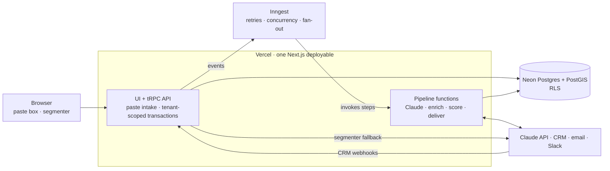

# Design B — Typed Monolith

> **Thesis:** one TypeScript codebase and one deployable, typed from the database schema to the lead card. The application server owns the logic, Postgres row-level security enforces tenancy beneath it, and Inngest makes the pipeline durable. This is the stack the spec recommends, worked out in detail.

**Status:** selected on Oct 3, 2026. The [workplan](../workplan.md) lays out how to build it. Ingestion was revised to manual paste on Oct 6, 2026.

This is one of three [design options](README.md). Decisions all three share are documented there and not repeated here, including how [manual-paste ingestion](README.md#ingestion-manual-paste) works.

## Stack

| Layer | Pick |
|---|---|
| App and API | Next.js App Router and tRPC on Vercel |
| Database | Neon Postgres with PostGIS and pg_trgm; Drizzle ORM for queries, migrations and RLS policies |
| Background work | Inngest durable functions, served by the same app at `/api/inngest` |
| Auth | Better Auth (magic link, TOTP, organizations), or WorkOS if brokerages require SAML SSO |
| Ingest | Paste page. The segmenter is one TypeScript module shared by browser and server; the `ingest.segment` and `ingest.submit` tRPC procedures |
| Secrets | API keys in Vercel's encrypted environment settings. There are no source credentials, so there's no KMS envelope encryption |
| Frontend | First page of cards rendered on the server; client components for the feed (TanStack Query and Virtual) and the map (MapLibre, Supercluster); URL state via `nuqs` |
| Email, Slack | Resend or Postmark; Slack incoming webhooks |

**Variant:** Supabase can host the database instead of Neon. You keep this design's TypeScript-first shape, but use Supabase Auth instead of an auth library. The new-leads pill and paste progress also get pushed updates instead of polling.

## Architecture



## Pipeline

The pipeline is a module inside the app, `src/pipeline`, which Inngest invokes. Each stage is a function triggered by an event, and each external call is a `step.run`. Inngest saves each completed step's result, so when a step fails it retries that step rather than the whole job.

```ts
// Sketch. One run per pasted post. The per-tenant cap keeps a 500-post paste from flooding the model APIs.
export const interpretPost = inngest.createFunction(
  {
    id: "interpret-post",
    concurrency: { key: "event.data.tenantId", limit: 10 },
    retries: 4, // exponential backoff between attempts
  },
  { event: "raw/stored" },
  async ({ event, step }) => {
    const gate = await step.run("regex-gate", () => regexGate(event.data.rawPostId));
    if (!gate.passed) return;
    const verdict = await step.run("classify", () => classify(event.data.rawPostId)); // Haiku 4.5
    if (!verdict.isJobChange) return; // below the floor: dropped and logged (EXT-4)
    const records = await step.run("extract", () => extract(event.data.rawPostId)); // Sonnet, structured output
    await step.run("enrich-and-score", () => assembleLeads(records));
  },
);
```

- **Paste and preview.** The Ingest page reads the clipboard's text and HTML and runs the segmenter in the browser, so the preview appears instantly. When the rules can't split a paste, `ingest.segment` asks Haiku for line ranges. You fix any mis-split posts and submit.
- **Store.** `ingest.submit` writes the `source_runs` row and the raw posts in one transaction (ING-7, ING-11, ING-12, PRIV-5):
  - each post is keyed on its activity id or content hash, with `ON CONFLICT DO NOTHING`
  - suppressed people are dropped before the insert

  After the transaction commits, it sends one `raw/stored` event per new post.
- **Interpret.** A `raw/stored` event runs gate → classify → extract → enrich → score as steps of one function (sketch above).
- **Progress.** Each paste's counts in `source_runs` update as its posts move through. The Ingest page polls them every few seconds (ING-15).
- **Failures.** Each function's `onFailure` handler writes to `dead_letters`. The admin retry button re-sends the original event (ING-14).
- **Re-extraction** (EXT-8) is an admin action. It emits `extract/requested` for every raw post still inside retention, tagged with the new extractor version. A concurrency cap keeps the backfill from crowding out live traffic.
- **Rescoring** (SCO-3, SCO-4) walks a tenant's leads 1,000 at a time and calls the same pure `score()` function the live pipeline uses. It writes a `score_audit` row for each score that changes.

## Tenancy and security

The app connects to Postgres as `app_user`. That role doesn't own the tables and can't bypass RLS (it lacks `BYPASSRLS`). The tables also set `FORCE ROW LEVEL SECURITY` as a backstop. Every tRPC procedure gets its database handle from one middleware, which opens a transaction and sets the tenant context on it:

```ts
export const tenantProcedure = authedProcedure.use(({ ctx, next }) =>
  db.transaction(async (tx) => {
    await tx.execute(sql`select set_config('app.tenant_id', ${ctx.tenantId}, true),
                                set_config('app.user_id',   ${ctx.userId},   true),
                                set_config('app.role',      ${ctx.role},     true)`);
    return next({ ctx: { ...ctx, db: tx } });
  }),
);
```

RLS policies read those settings. A query that forgets `where tenant_id = …` still returns only the tenant's rows.

The weak point is a query that bypasses the middleware altogether. Three guards cover it:

- The root `db` client isn't exported outside `src/server/db`.
- A lint rule bans importing it anywhere else.
- A CI test runs every procedure as tenant A and asserts it never sees tenant B's fixtures.

Use Neon's WebSocket (pooled) driver. Its HTTP driver can't hold the interactive transaction this pattern needs.

- **Admin MFA** (SEC-1). Admin procedures require a session that has completed a TOTP challenge.
- **Protected-field exclusion.** `ScoringInput` is a strict Zod schema with only the allowed fields. A lint rule stops the scoring module from importing the database layer, so it only ever sees what `toScoringInput()` hands it. A unit test fails if anyone adds a field.
- **Audit** (AUD-1). A middleware records view, export, edit and delete events.
- **Export** (SEC-4) is its own permissioned procedure. It logs the row count and filter, re-checks suppression (INT-8), and streams the CSV.
- **Who can paste.** `ingest.submit` accepts admins by default, or agents too if the tenant setting allows it. A paste is capped at 500 posts.

## Dashboard

- One `buildLeadFilter(filters)` returns a Drizzle `SQL` predicate. `leads.page` and `leads.points` both use it (MAP-6).
- The first 25 cards render on the server and stream with the HTML, which helps meet the 2.5-second interactive target. After that, TanStack Query handles infinite scroll with keyset cursors (FEED-3).
- Filters live in the URL through `nuqs` (MAP-9). Saved views store the same serialized filter (UI-2).
- The new-leads pill polls `leads.newSince({ filters, since })` every 60 seconds. That's a cheap count served from an index (FEED-11).
- The Ingest page has the paste box, the preview table, and live counts for each paste.

## Integrations

A status change writes an `outbox` row in the same transaction. An Inngest function delivers outbox rows to the CRM connector, outbound webhooks and Slack.

CRM webhooks arrive at a route handler. It verifies the signature, maps the CRM stage to a lead status, and writes a `lead_event`, using the CRM event id to stay idempotent. A nightly reconciliation catches anything missed (INT-3).

The daily digest is an Inngest cron job per tenant (INT-4). The public privacy-request form posts to its own route handler (PRIV-4).

## Cost and timeline

| Item | Est. $/month |
|---|---|
| Vercel Pro | 20 per seat |
| Neon with PostGIS | 20–70 |
| Inngest | 0–100 |
| Auth (Better Auth runs in the app; WorkOS SSO costs extra per connection) | 0+ |
| Email | 0–20 |
| **Infra total** | **~60–200** |
| LLM ([cost model](README.md#llm-cost-model)) | ~15 |

The spec's top-down estimate is 4–6 weeks to the Phase 1 gate. The bottom-up [workplan](../workplan.md) puts it at about 9 weeks for two engineers, including a two-week pilot.

## Risks

| Risk | Mitigation |
|---|---|
| A query escapes the tenant transaction | Non-owner role with FORCE RLS; root client can't be imported; cross-tenant tests in CI |
| An Inngest outage stalls the pipeline | Steps are idempotent and resume on recovery. Pastes wait in the raw store, so an outage delays leads but loses nothing. Inngest can be self-hosted if outages become a pattern |
| Serverless time limits | Every model call is its own step; no step makes more than one |
| LinkedIn changes its page layout, and the segmenter's rules stop splitting cleanly | The Haiku fallback; the preview shows every split before anything is stored; fixture tests built from real pastes run in CI |
| Vendor sprawl | Hold it to four: Vercel, Neon, Inngest, email. Auth runs inside the app |
| Weak person matching in TypeScript | Start with deterministic keys plus trigram similarity. If person-dedup precision misses its target on the golden set, that's the signal to move the pipeline toward Design C |

## Pros

- **It's the spec's own pick.** Its stack table, phase estimates and non-choices apply unchanged, so there's nothing to re-argue.
- **One language, types end to end.** A schema change shows up as a compile error in the card that renders it. Logic is plain TypeScript, which is easy to unit-test and review. The segmenter is one module, shared by the browser preview and the server.
- **Inngest covers the pipeline plumbing:** step-level retries with backoff, per-tenant concurrency caps, failure handlers and run history.
- **Two layers of tenant protection.** Authorization reads as TypeScript middleware, and RLS still catches a mistake.
- **The easiest to hire for and hand off.** Neon can give each pull request its own branch of the database for rehearsing migrations and backfills.

## Cons

- **More vendors.** Vercel, Neon, Inngest, auth and email mean more bills, more dashboards and more failure points. Inngest sits in the path of every pipeline step.
- **Tenant context depends on discipline.** One query on the wrong client skips it. The mitigations work, but they're conventions and tests, not structure.
- **Serverless shapes the code.** Work has to be chopped into short steps. That's mostly healthy, but awkward for large exports.
- **TypeScript has thin tooling for data work.** Person matching, company matching and evaluation analysis need more hand-rolled code.
- **More code than A** for the same features: an API layer, auth wiring, and polling instead of push.

**Choose B if:**

- you have TypeScript engineers, or plan to hire them
- you expect to grow toward multi-brokerage SaaS
- you want the default that most teams can maintain
