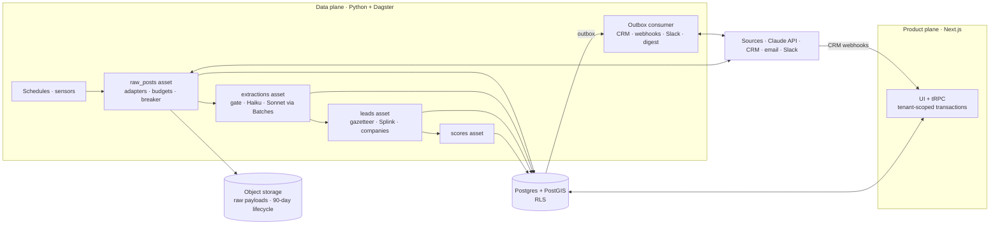

# Design C — Two Planes

> **Thesis:** treat the pipeline as a data product with its own runtime. A Python data plane, orchestrated by Dagster, owns acquisition, interpretation, entity resolution, scoring and outbound delivery. A TypeScript product plane owns the dashboard and user actions; it's Design B's app without the pipeline module. The two planes share Postgres and communicate through tables, not network calls.

This is one of three [design options](README.md). Decisions all three share are documented there and not repeated here.

## Stack

| Layer | Pick |
|---|---|
| Data plane | Python 3.12 and Dagster OSS (webserver, daemon, code location) in containers on Fly.io or AWS ECS |
| LLM calls | Anthropic Python SDK through the Message Batches API; Pydantic models for `RawPost` and the extraction schema |
| Entity resolution | Splink (probabilistic record linkage, DuckDB backend) for people; rapidfuzz against a company table for employers |
| Raw store | Object storage (S3 or R2), one object per raw post, deleted by a 90-day lifecycle rule. Postgres keeps an index row per post: ids, hashes, URL, run, object key |
| Lead store | Postgres with PostGIS (RDS or Neon) |
| Product plane | Next.js, tRPC and Drizzle on Vercel, as in Design B, minus `src/pipeline` |
| Contract | Drizzle migrations own the schema. CI regenerates the Python table models from the migrated schema. An `outbox` table carries events between the planes |
| Secrets | AWS Secrets Manager, one secret per (tenant, source) |

## Architecture



## Pipeline

The pipeline is a graph of Dagster assets, partitioned by day and by (tenant, source) pair. The (tenant, source) dimension is dynamic, so pairs can be added and removed at runtime (SRC-5).

```python
# Sketch. ClaudeBatches and Postgres are this project's resources, not Dagster built-ins.
partitions = MultiPartitionsDefinition({
    "day": DailyPartitionsDefinition(start_date="2026-11-01"),
    "tenant_source": DynamicPartitionsDefinition(name="tenant_source"),
})

@asset(partitions_def=partitions, deps=["raw_posts"], code_version="extract-v7")  # code_version is the extractor version
def extractions(context: AssetExecutionContext, claude: ClaudeBatches, db: Postgres) -> MaterializeResult:
    ...  # gate, Haiku batch, Sonnet batch, versioned rows in `extractions`

@asset_check(asset=extractions, blocking=True)  # below-target extractions never reach `leads`
def golden_set_gate(db: Postgres) -> AssetCheckResult:
    ...  # read the golden-set eval for this code_version, running it once if missing
```

- **Acquire.** Every 6 hours, a schedule fills in ("materializes") the latest `raw_posts` partition for each enabled pair (ING-6). Ops draw on the shared Postgres budget counter (ING-8) and use the same backoff-and-breaker HTTP wrapper as the other designs. A tripped breaker fails the run and alerts an admin (ING-9). Payloads go to object storage; index rows go to Postgres under the unique key (ING-7, DB-5).
- **Interpret in batches.** The regex gate runs in process. Posts that survive go to Haiku 4.5 in one Message Batch; the ones it confirms go to Sonnet in a second batch.
  - Batches cost half, and most finish within an hour.
  - But each batch can take up to 24 hours, so two in a row could breach the 24-hour freshness requirement.
  - So if a batch hasn't ended after 2 hours, the op cancels it and processes what's left synchronously.
- **Resolve.** Splink links each new person to existing `persons` rows. It compares only candidates that share a metro and surname initial ("blocking rules"), and weighs field matches with weights trained on your data. That catches the same person appearing in both a post and a press release, which exact keys miss (ING-13).

  This asset also handles gazetteer centroids, company resolution and seniority mapping, and it promotes extractions into `leads`. Because the golden-set check above is blocking, a new extractor version that misses its targets never reaches this step.
- **Score.** A Python implementation of the shared scoring function, with a Pydantic input model set to `extra="forbid"`. A weight change in the product plane writes an outbox event, and a sensor re-runs `scores` for that tenant (SCO-3). A daily schedule handles recency decay (SCO-4).
- **Re-extraction** (EXT-8). Bump `code_version`, and Dagster marks every materialized `extractions` partition as unsynced (out of date). Once the new version passes the golden-set check, a backfill re-runs those partitions from object storage, with no refetching.
- **Observability.** Dagster's run history and asset checks are the operator's view. The pipeline also writes `source_runs`, which the product plane's admin page displays (ING-15, ING-16, UI-9). Failed items go to `dead_letters`, and retrying re-runs them (ING-14).

## The product plane

This is Design B's app with no pipeline code: tenant-scoped transactions over RLS, one filter compiler for both feed and map, URL state and a polled new-leads pill.

User actions with side effects, such as a status change that has to reach the CRM, write `outbox` rows. A small long-running Python consumer delivers them, usually within seconds. It's a plain process rather than a Dagster job, because Dagster sensors poll about every 30 seconds and a webhook shouldn't wait for a scheduler tick. Inbound CRM webhooks land on a route handler in the product plane, as in B.

## Tenancy and security

- The product plane enforces tenancy exactly as Design B does.
- The data plane connects as a `pipeline` role. Each op runs for one (tenant, source) partition and sets `app.tenant_id` on its connection, so RLS covers pipeline writes too.
- Each op fetches exactly one secret from Secrets Manager, named by its (tenant, source) pair (SRC-6, SEC-7).
- Hard delete (PRIV-2) has one more step than in A or B: removing the person's raw-post objects from storage, located through their index rows. Object versions and backups must also expire within the 30-day deletion window.

## Cost and timeline

| Item | Est. $/month |
|---|---|
| Postgres (small RDS instance or Neon) | 50–100 |
| Dagster containers | 30–80 |
| Outbox consumer | 5–15 |
| Object storage | ~1 |
| Product plane on Vercel | 20 per seat |
| Monitoring and email | 20–50 |
| **Infra total** | **~150–300** |
| LLM through Batches ([cost model](README.md#llm-cost-model)) | ~25 |

About 6–9 weeks to the Phase 1 gate. Before the first lead you have to stand up two codebases, two deploy pipelines and the schema contract between them.

## Risks

| Risk | Mitigation |
|---|---|
| Schema drift between planes | One migration owner; generated Python models; contract tests on outbox payloads |
| Batch latency breaches freshness | 2-hour batch timeout with a synchronous fallback; alert when end-to-end latency passes 6 hours |
| Ops load on a small team | Move to managed Dagster+ if running the daemon becomes a chore |
| A second store complicates deletion | Index rows map each person to object keys. The delete procedure removes the objects, then the rows. Lifecycle rules cap leftovers at 90 days |
| Overbuilding before the thesis is proven | Start on Design B and extract the pipeline into this plane when one of the signals below appears |

## Pros

- **The best tools for the hardest data problems.** Splink for person and company matching; pandas and notebooks for golden-set analysis and calibration (EXT-9, EXT-10, REV-3).
- **Dagster's model maps cleanly onto the spec's pipeline:**
  - partitions by source and day
  - `code_version` as `extractor_version`, with backfills of unsynced partitions (EXT-8)
  - the golden set as a blocking check (EXT-9)
  - lineage as provenance (AUD-3)
  - run history (ING-15)
- **The cheapest per post at scale.** Batches halve LLM spend, and a million raw posts stay out of Postgres. The lifecycle rule enforces the 90-day purge on its own.
- **The planes deploy and scale independently.** A data engineer and a product engineer don't share a deploy queue. This shape also fits if licensed bulk feeds become the main source.

## Cons

- **Two languages, two type systems and two deploy pipelines,** joined by a schema contract that can drift.
- **The slowest path to the Phase 1 gate, at the highest fixed cost.** It's overkill for one metro at 50,000 posts a month.
- **It breaks two of the spec's deliberate non-choices:** no microservices, and a single store. Every deletion has to reach the second store too.
- **Dagster fits event-driven work poorly,** so outbound delivery needs its own consumer process.
- **Batch latency needs a fallback** to stay inside the freshness requirement.

**Choose C if** any of these become the constraint:

- licensed bulk data
- ten or more metros
- person-matching precision

Or choose it when a data engineer joins.

**Or reach it from B.** B's pipeline module has the same stages and the same database contract, so moving it into this plane later is an extraction, not a rewrite. Signals to watch for:

- person-dedup precision below target on the golden set
- LLM spend over about $500 a month
- a second licensed feed
