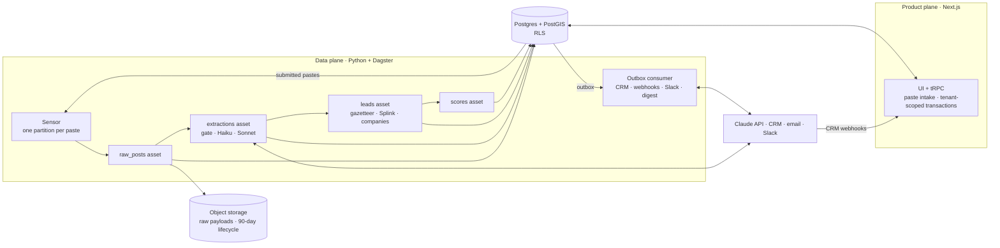

# Design C — Two Planes

> **Thesis:** treat the pipeline as a data product with its own runtime. A Python data plane, orchestrated by Dagster, owns interpretation, entity resolution, scoring and outbound delivery. A TypeScript product plane owns the dashboard, paste intake and user actions; it's Design B's app without the pipeline module. The two planes share Postgres and communicate through tables, not network calls.

**With manual paste, most of C's case is gone.** It was built for bulk automated feeds: batch pricing, object storage for a million raw posts, and planes that scale independently. At human paste volume none of that pays off, and the Batches API can't serve pastes because someone is waiting for the result. What's left is Python's tooling for matching people and evaluating extraction.

This is one of three [design options](README.md). Decisions all three share are documented there and not repeated here, including how [manual-paste ingestion](README.md#ingestion-manual-paste) works.

## Stack

| Layer | Pick |
|---|---|
| Data plane | Python 3.12 and Dagster OSS (webserver, daemon, code location) in containers on Fly.io or AWS ECS |
| Ingest | The product plane's paste page, as in Design B. A Dagster sensor turns each submitted paste into a partition |
| LLM calls | Anthropic Python SDK: synchronous calls for pastes, and the Message Batches API only for re-extraction backfills. Pydantic models for `RawPost` and the extraction schema |
| Entity resolution | Splink (probabilistic record linkage, DuckDB backend) for people; rapidfuzz against a company table for employers |
| Raw store | Object storage (S3 or R2), one object per raw post, deleted by a 90-day lifecycle rule. Postgres keeps an index row per post: ids, hashes, URL, run, object key |
| Lead store | Postgres with PostGIS (RDS or Neon) |
| Product plane | Next.js, tRPC and Drizzle on Vercel, as in Design B, minus `src/pipeline` |
| Contract | Drizzle migrations own the schema. CI regenerates the Python table models from the migrated schema. An `outbox` table carries events between the planes |
| Secrets | AWS Secrets Manager for API keys |

## Architecture



## Pipeline

The pipeline is a graph of Dagster assets, with one dynamic partition per paste.

```python
# Sketch. ClaudeClient and Postgres are this project's resources, not Dagster built-ins.
pastes = DynamicPartitionsDefinition(name="paste_run")  # a sensor adds one partition per submitted paste

@asset(partitions_def=pastes, deps=["raw_posts"], code_version="extract-v7")  # code_version is the extractor version
def extractions(context: AssetExecutionContext, claude: ClaudeClient, db: Postgres) -> MaterializeResult:
    ...  # gate, then synchronous Haiku and Sonnet calls; versioned rows in `extractions`

@asset_check(asset=extractions, blocking=True)  # below-target extractions never reach `leads`
def golden_set_gate(db: Postgres) -> AssetCheckResult:
    ...  # read the golden-set eval for this code_version, running it once if missing
```

- **Pick up pastes.** `ingest.submit` in the product plane checks suppression (PRIV-5) and stores the parsed paste in a staging row. About every 30 seconds, a sensor adds each new paste as a partition. Materializing `raw_posts` for that partition does two things (ING-7, ING-11, ING-12):
  - it writes the payloads to object storage
  - it writes index rows to Postgres under the unique key

  The staging row is then deleted.
- **Interpret synchronously.** The regex gate runs in process. Haiku 4.5 and Sonnet are then called directly, with a concurrency limit, because someone is waiting on the paste.
- **Resolve.** Splink links each new person to existing `persons` rows. It compares only candidates that share a metro and surname initial ("blocking rules"), and weighs field matches with weights trained on your data. That catches the same person appearing in two different pastes, which exact keys miss (ING-13).

  This asset also handles gazetteer centroids, company resolution and seniority mapping, and it promotes extractions into `leads`. Because the golden-set check above is blocking, a new extractor version that misses its targets never reaches this step.
- **Score.** A Python implementation of the shared scoring function, with a Pydantic input model set to `extra="forbid"`. A weight change in the product plane writes an outbox event, and a sensor re-runs `scores` for that tenant (SCO-3). A daily schedule handles recency decay (SCO-4).
- **Re-extraction** (EXT-8). Bump `code_version`, and Dagster marks every materialized `extractions` partition as unsynced (out of date). Once the new version passes the golden-set check, a backfill re-runs those partitions from object storage, with no refetching.
  - Nobody waits on a backfill, so it goes through the Message Batches API at half price.
  - If a batch hasn't ended after 2 hours, the remainder runs synchronously.
- **Observability.** Dagster's run history and asset checks are the operator's view. The pipeline also writes each paste's counts to `source_runs`, which the product plane's Ingest page displays (ING-15). Failed items go to `dead_letters`, and retrying re-runs them (ING-14).

## The product plane

This is Design B's app with no pipeline code: tenant-scoped transactions over RLS, one filter compiler for both feed and map, URL state and a polled new-leads pill. It includes B's paste page and segmenter. Submitting a paste writes a staging row that the data plane picks up.

User actions with side effects, such as a status change that has to reach the CRM, write `outbox` rows. A small long-running Python consumer delivers them, usually within seconds. It's a plain process rather than a Dagster job, because Dagster sensors poll about every 30 seconds and a webhook shouldn't wait for a scheduler tick. Inbound CRM webhooks land on a route handler in the product plane, as in B.

## Tenancy and security

- The product plane enforces tenancy exactly as Design B does.
- The data plane connects as a `pipeline` role. Each op runs for one paste partition, which belongs to one tenant, and sets `app.tenant_id` on its connection, so RLS covers pipeline writes too.
- Hard delete (PRIV-2) has one more step than in A or B: removing the person's raw-post objects from storage, located through their index rows. Object versions and backups must also expire within the 30-day deletion window.

## Cost and timeline

| Item | Est. $/month |
|---|---|
| Postgres (small RDS instance or Neon) | 50–100 |
| Dagster containers | 30–80 |
| Outbox consumer | 5–15 |
| Object storage | ~1 |
| Product plane on Vercel | 20 per seat |
| Monitoring and email | 20–50 |
| **Infra total** | **~150–300** |
| LLM, synchronous for pastes ([cost model](README.md#llm-cost-model)) | ~15 |

About 5–8 weeks to the Phase 1 gate. Before the first lead you have to stand up two codebases, two deploy pipelines and the schema contract between them.

## Risks

| Risk | Mitigation |
|---|---|
| Schema drift between planes | One migration owner; generated Python models; contract tests on outbox payloads and the paste staging row |
| Sensor delay on every paste | About 30 seconds before processing starts. The Ingest page shows the paste as queued in the meantime |
| LinkedIn changes its page layout, and the segmenter's rules stop splitting cleanly | The Haiku fallback; the preview shows every split before anything is stored; fixture tests built from real pastes run in CI |
| Ops load on a small team | Move to managed Dagster+ if running the daemon becomes a chore |
| A second store complicates deletion | Index rows map each person to object keys. The delete procedure removes the objects, then the rows. Lifecycle rules cap leftovers at 90 days |
| Overbuilding before the thesis is proven | Start on Design B and extract the pipeline into this plane when one of the signals below appears |

## Pros

- **The best tools for the hardest data problems.** Splink for person and company matching; pandas and notebooks for golden-set analysis and calibration (EXT-9, EXT-10, REV-3).
- **Dagster's model maps cleanly onto the spec's pipeline:**
  - one partition per paste
  - `code_version` as `extractor_version`, with backfills of unsynced partitions (EXT-8)
  - the golden set as a blocking check (EXT-9)
  - lineage as provenance (AUD-3)
  - run history (ING-15)
- **Backfills at half price.** Re-extraction runs through the Batches API, and the lifecycle rule enforces the 90-day purge on its own. At paste volume this saves only a few dollars a month.
- **The planes deploy and scale independently.** A data engineer and a product engineer don't share a deploy queue. It's also the right shape if you ever add bulk automated sources.

## Cons

- **Two languages, two type systems and two deploy pipelines,** joined by a schema contract that can drift.
- **The slowest path to the Phase 1 gate, at the highest fixed cost.** It's overbuilt for a few thousand pasted posts a month.
- **It breaks two of the spec's deliberate non-choices:** no microservices, and a single store. Every deletion has to reach the second store too.
- **Dagster fits event-driven work poorly,** so outbound delivery needs its own consumer process, and every paste waits up to 30 seconds for the sensor.
- **Pastes can't use the Batches API,** so its savings only reach backfills.

**Choose C only if** one of these becomes the constraint:

- you add bulk automated sources later
- person-matching precision
- you hire a data engineer

**Or reach it from B.** B's pipeline module has the same stages and the same database contract, so moving it into this plane later is an extraction, not a rewrite. Signals to watch for:

- person-dedup precision below target on the golden set
- LLM spend over about $500 a month
- an automated bulk source joining manual paste
